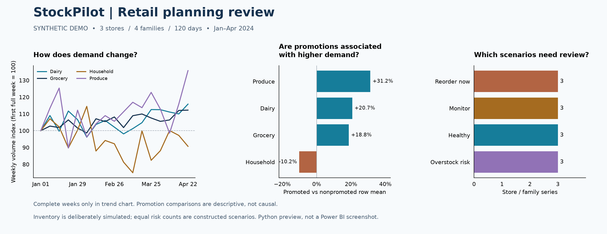

# Sample business review

Generated from the included **synthetic sample**, 2024-01-01 through 2024-04-29. Reproduce with `python scripts/build_sample_brief.py` after installing `requirements-visuals.txt`. The script runs the pipeline in temporary storage and leaves current exports unchanged.



## Decision context

A hypothetical retail planning analyst needs to decide what to investigate in a weekly review: demand changes, promotion performance and replenishment exceptions. This demonstration delivers an evidence-backed review queue, not purchasing decisions or real-company results.

## Observations → interpretation → action

| Question | Measured sample evidence | Suggested next action | What we cannot conclude |
|---|---|---|---|
| Where is demand concentrated? | Store 3 contributes 69,167.01 of 176,589.03 volume (39.2%); all stores have 120 observed dates. | Start a store/family demand review there; check the category mix. | Higher volume does not imply higher profit or greater efficiency. Mixed category units are only a rough workload indicator. |
| Which family is relatively variable? | Household has the largest daily family CV: 0.320. CV = sample standard deviation / mean, using daily totals across stores. | Inspect day-level spikes and individual stores before adjusting buffers. | CV alone does not measure forecast error or justify a service-level promise. |
| Which planning exceptions need review? | 3 of 12 series fall below the assumed reorder point; 3 exceed the overstock threshold. | Verify actual stock, inbound orders and lead times before any order decision. | The sample deliberately creates equal risk counts. These are not observed stockouts or measured operational problems. |

### Promotion associations

Means below are per store/family/day observation. Unknown promotion status would be excluded from both groups. Percentage difference = 100 × (promoted mean / nonpromoted mean − 1).

| Family | Promoted rows | Other known rows | Promoted mean | Nonpromoted mean | Difference |
|---|---:|---:|---:|---:|---:|
| HOUSEHOLD | 78 | 282 | 37.28 | 41.49 | -10.2% |
| GROCERY | 79 | 281 | 262.36 | 220.92 | +18.8% |
| DAIRY | 78 | 282 | 109.84 | 90.98 | +20.7% |
| PRODUCE | 78 | 282 | 153.48 | 116.95 | +31.2% |

Household's negative association is a prompt to inspect timing and store mix, not to cancel promotions. Produce's positive association is not proof of incremental demand. These patterns were generated deliberately; this exercise demonstrates a method, not a discovery about real shoppers. Prices and margins are absent, so promotion profitability cannot be evaluated.

## Trend chart interpretation

Compare each family's weekly volume with its own first full week (index 100). This avoids putting categories with different scales on one raw-volume axis. The 17 complete Monday–Sunday weeks are included; the final one-day week is excluded. The index shows relative changes, not absolute size, growth caused by promotions or forecast accuracy.

## Analysis workflow

1. **Question:** What should a planner investigate first, and what evidence supports that choice?
2. **Preparation:** Validate date/store/family uniqueness and nonnegative demand; retain unknowns instead of silently filling them with zero.
3. **Analysis:** Use SQL groupings, conditional averages and variability measures. Run [the business questions](../sql/business_questions.sql) against the generated DuckDB database.
4. **Communication:** Separate observations, assumptions and actions. Use the visual preview here; the actual Power BI report remains a manual build.
5. **Limits:** Synthetic data, category rather than SKU grain, assumed inventory/lead times, no prices and no forecast holdout. A sensible next step is real-data validation, not more infrastructure.

### Run the SQL examples

After running the sample pipeline, execute from the project root:

```bash
python - <<'SQL_DEMO'
from pathlib import Path
import duckdb
with duckdb.connect("data/processed/stockpilot.duckdb", read_only=True) as con:
    for query in con.extract_statements(Path("sql/business_questions.sql").read_text()):
        print(con.execute(query.query).df().to_string(index=False))
SQL_DEMO
```

### Project summary

StockPilot translates retail demand into a planning review using Python validation, SQL aggregation in DuckDB, and a simple trailing-average baseline for simulated replenishment scenarios. The Power BI model and reproducible analytical preview show how the outputs can support reporting, while the synthetic sample keeps the results clearly separated from real business outcomes.

Python and SQL make the calculations repeatable; Power BI is the planned presentation layer. The SQL examples, data-quality checks and inventory formulas provide reproducible checkpoints for the analysis.
